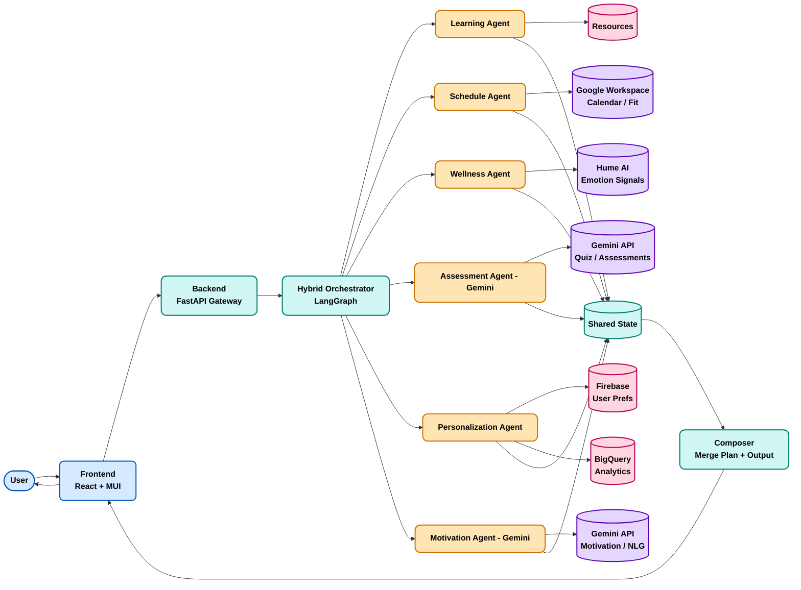
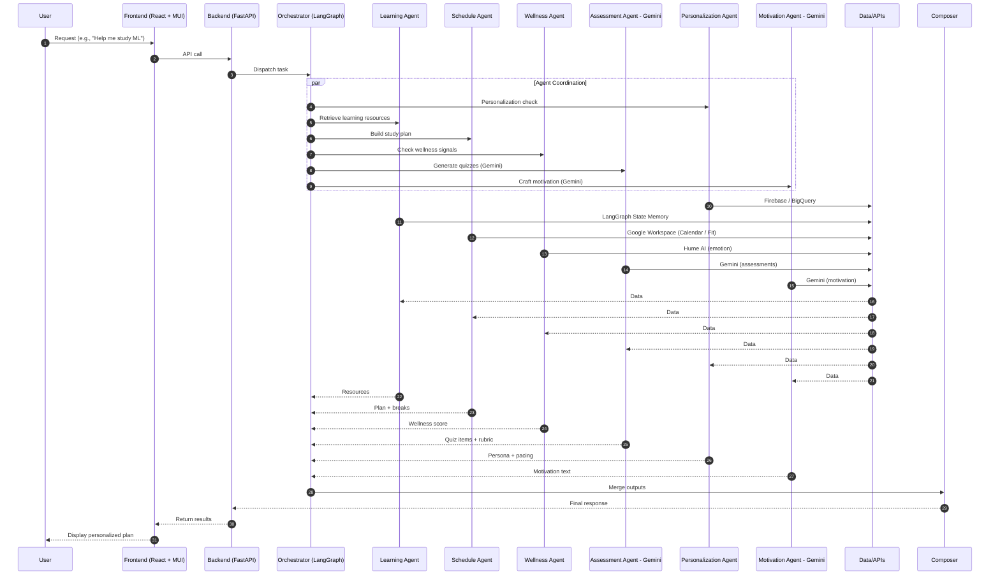

# 🔍 AI-Powered Study Assistant - Comprehensive Project Analysis

**Project Name**: AI-Powered Study Assistant
**Repository**: AI-Powered-Study-Assistant
**Owner**: sanjaynesan-05
**Branch**: agents
**Analysis Date**: October 8, 2025

---

## 📊 Executive Summary

The AI-Powered Study Assistant is a sophisticated, full-stack educational platform that leverages artificial intelligence to provide personalized learning experiences. It combines modern web technologies with advanced AI capabilities to create an intelligent mentoring system for students and professionals.

### 🎯 Core Objectives

* **Personalized Learning**: AI-driven adaptive learning paths tailored to individual needs
* **Intelligent Mentoring**: Real-time AI assistance for academic and career guidance
* **Resume Optimization**: AI-powered resume analysis and enhancement
* **Progress Tracking**: Comprehensive learning analytics and progress monitoring
* **Multi-Modal Learning**: Support for videos, articles, assessments, and interactive content

---

## 🏗️ System Architecture Overview

### High-Level Architecture Diagram

---

## 🔄 Data Flow Architecture

### 1. User Interaction Flow (Sequence Diagram)

