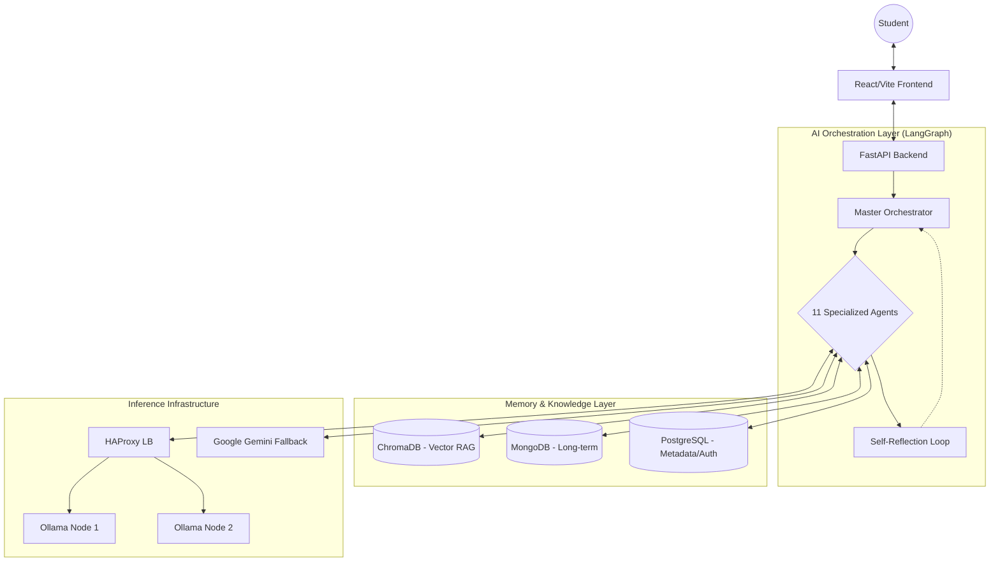

# AI-Powered Study Assistant: Technical Deep Dive & Project Report

## 🚀 Executive Summary
The **AI-Powered Study Assistant** is a cutting-edge, production-ready educational ecosystem designed to democratize personalized learning. Unlike traditional e-learning platforms, this system leverages a **Multi-Agent Orchestration $(\text{MAO})$** framework powered by **LangGraph**, enabling autonomous reasoning, emotional intelligence, and self-improving pedagogy.

The system integrates 11 specialized AI agents that collaborate in real-time to curate resources, detect student burnout, generate adaptive assessments, and maintain long-term memory of a student's learning journey.

---

## 🏗️ System Architecture

### High-Level Components


---

## 🤖 The 11-Agent Ecosystem
The core of the project is the **LangGraph Workflow**, which coordinates 11 distinct intelligence entities:

| Agent | File Path | Core Responsibility |
| :--- | :--- | :--- |
| **1. Orchestrator** | `orchestrator.py` | Intent detection and emotion analysis. |
| **2. Personalization** | `personalization.py` | Infers learning style (Visual, Auditory, Kinaesthetic) and adjusts pace. |
| **3. Skill Graph** | `skill_graph.py` | Reasons over prerequisites using **NetworkX** to build logical learning paths. |
| **4. Resource** | `learning_resource.py` | Integrated with **YouTube API** & AI search to curate high-quality content. |
| **5. Assessment** | `assessment.py` | Generates adaptive quizzes; difficulty scales with user performance. |
| **6. Reflection** | `reflection.py` | **Self-Improvement loop:** Critically analyzes its own plan and triggers replanning if needed. |
| **7. Wellness** | `wellness.py` | Monitors fatigue and stress; schedules breaks to prevent burnout. |
| **8. Scheduler** | `scheduler.py` | Optimizes study time based on deadlines and wellness metrics. |
| **9. Motivation** | `motivation.py` | Provides customized psychological support and coach-like encouragement. |
| **10. Memory** | `mongodb_store.py` | Pattern recognition across sessions; maintains the "Learner Profile." |
| **11. Explainability** | `explainability.py` | **Transparent AI:** Justifies why specific resources/paths were chosen. |

---

## 🛠️ Technology Stack

### Frontend (User Interface)
- **Framework**: React 18 with TypeScript.
- **Build Tool**: Vite.
- **Styling**: Tailwind CSS & Framer Motion (for fluid micro-animations).
- **Data Visuals**: **D3.js** for real-time Skill Graph and Knowledge Tree visualizations.
- **State Management**: React Context & Hooks.

### Backend (Logic & APIs)
- **Framework**: **FastAPI** (Python 3.11).
- **Orchestration**: **LangGraph** (Stateful multi-agent workflows).
- **Task Queue**: **Celery** with **Redis** for asynchronous agent processing.
- **API Clients**: `httpx` for async communication with Ollama/Gemini.

### Intelligence & AI
- **Local Inference**: **Ollama** (Llama 3.2, Mistral, Qwen).
- **Cloud Inference**: **Google Gemini 1.5 Pro/Flash** (used for high-reasoning tasks or as a fallback).
- **RAG Implementation**: LangChain with **ChromaDB** for vector-based document retrieval.

### Infrastructure & Persistence
- **Vector Database**: ChromaDB (stores educational embeddings).
- **NoSQL**: MongoDB (stores nested interactive session history).
- **SQL**: PostgreSQL (handles user authentication and structured metadata).
- **Load Balancing**: **HAProxy** sitting in front of a mesh of Ollama workers.
- **MCP Server**: **Wellness-MCP-Server** provides specialized Model Context Protocol tools for wellness tracking.

---

## 🔬 Key Innovations

### 1. Autonomous Replanning Loop
The system doesn't just follow a static script. The **Reflection Agent** evaluates the outcome of the learning resource and assessment generation. If the "Confidence Score" is low or the goals aren't met, it loops the workflow back to the **Skill Graph Reasoning** node to adjust the strategy—simulating a real human tutor's adaptability.

### 2. Distributed Ollama Mesh
To handle the heavy load of 11 agents running simultaneously, the project implements an **HAProxy-managed load balancer** for Ollama nodes. This allows the system to distribute LLM inference across multiple GPUs/containers, ensuring low-latency responses even during complex reasoning chains.

### 3. Emotion-Aware Learning
By analyzing the `emotional_tone` during intent detection, the system adjusts its responses. A "stressed" user will receive more encouragement from the **Motivation Agent** and more frequent breaks from the **Wellness Agent**.

---

## 📦 Setup & Deployment

### Prerequisites
- Docker & Docker Compose
- Python 3.11+
- Node.js 18+
- Gemini API Key (Optional fallback)

### Docker Deployment (Recommended)
```bash
docker-compose up --build -d
```
This launches the backend, frontend, ChromaDB, Redis, and the HAProxy Ollama mesh in a single unified network.

### Manual Backend Setup
```bash
cd python-backend
python -m venv venv
./venv/Scripts/activate
pip install -r requirements.txt
uvicorn app.main:app --reload --port 8000
```

### Manual Frontend Setup
```bash
cd frontend
npm install
npm run dev
```

---

## 🏆 SIH 2025 Readiness
This project goes beyond a simple chatbot. It is a complete **GenAI Operating System** for education. With its production-grade monitoring, explainable AI components, and complex multi-agent coordination, it stands as a top-tier contender for institutional deployment.

---
**Maintained by**: AI Development Team  
**Last Updated**: April 2026
