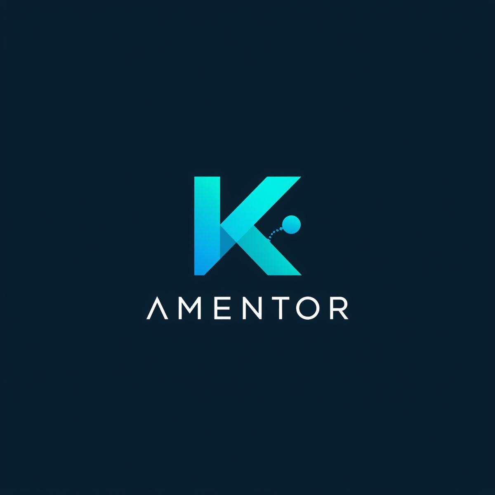

# AI Mentor Platform

A comprehensive AI-powered mentoring platform designed to provide personalized guidance, career advice, learning path suggestions, resume analysis, and interview preparation assistance.



## 📚 Table of Contents

- [Features](#features)
- [Project Structure](#project-structure)
- [Getting Started](#getting-started)
- [Technology Stack](#technology-stack)
- [Documentation](#documentation)
- [Contributing](#contributing)
- [License](#license)

## 🌟 Features

- **AI Mentor Conversations**: Engage with an AI mentor for personalized guidance on various topics.
- **Career Guidance**: Receive career advice tailored to your skills and interests.
- **Learning Path Suggestions**: Get customized learning paths based on your career goals.
- **Resume Analysis**: Get professional feedback on your resume.
- **Resume Builder**: Create professional resumes with guided assistance.
- **Interactive User Interface**: Modern, responsive UI with light/dark mode.
- **Personalized Recommendations**: Receive tailored content based on your profile.
- **User Authentication**: Secure login and registration system.

## 🏗️ Project Structure

```
├── backend/               # Express.js backend
│   ├── src/
│   │   ├── config/        # Database and app configuration
│   │   ├── controllers/   # Request handlers
│   │   ├── middleware/    # Custom middleware
│   │   ├── models/        # MongoDB models
│   │   └── routes/        # API routes
└── frontend/              # React (TypeScript) frontend
    ├── src/
    │   ├── assets/        # Static assets
    │   ├── components/    # Reusable UI components
    │   ├── contexts/      # React contexts
    │   ├── pages/         # Application pages
    │   ├── services/      # API service layer
    │   ├── types/         # TypeScript types
    │   └── utils/         # Utility functions
```

## 🚀 Getting Started

### Prerequisites

- Node.js (v16+)
- MongoDB
- npm or yarn

### Installation

1. Clone the repository:
   ```
   git clone https://github.com/yourusername/ai-mentor-platform.git
   cd ai-mentor-platform
   ```

2. Install backend dependencies:
   ```
   cd backend
   npm install
   ```

3. Install frontend dependencies:
   ```
   cd ../frontend
   npm install
   ```

4. Create a `.env` file in the backend directory with the following variables:
   ```
   PORT=5000
   MONGODB_URI=your_mongodb_connection_string
   JWT_SECRET=your_secret_key
   JWT_EXPIRE=30d
   ```

5. Start the application:
   - On Windows: `start_services.bat`
   - On Unix/Mac: `./start_services.sh`
   - Or manually:
     ```
     # Terminal 1
     cd backend
     npm run dev

     # Terminal 2
     cd frontend
     npm run dev
     ```

6. Open http://localhost:5173 in your browser

## 💻 Technology Stack

### Backend
- Node.js
- Express.js
- MongoDB with Mongoose
- JWT Authentication
- RESTful API

### Frontend
- React 18
- TypeScript
- TailwindCSS
- Framer Motion for animations
- Vite for build tooling
- React Router for navigation

## 📖 Documentation

Detailed documentation is available in the [docs](./docs) directory:

- [API Documentation](./docs/API_DOCS.md)
- [User Guide](./docs/USER_GUIDE.md)
- [Development Guide](./docs/DEVELOPMENT_GUIDE.md)
- [Database Schema](./docs/DATABASE_SCHEMA.md)

## 🤝 Contributing

Contributions are welcome! Please read our [contributing guidelines](./CONTRIBUTING.md) before submitting a pull request.

## 📄 License

This project is licensed under the MIT License - see the [LICENSE](./LICENSE) file for details.
