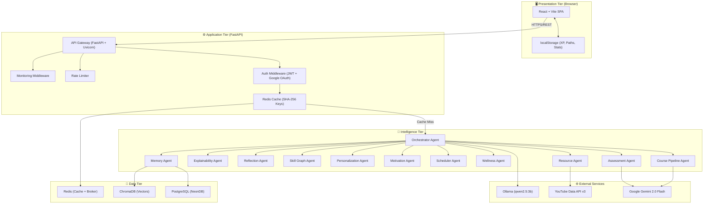
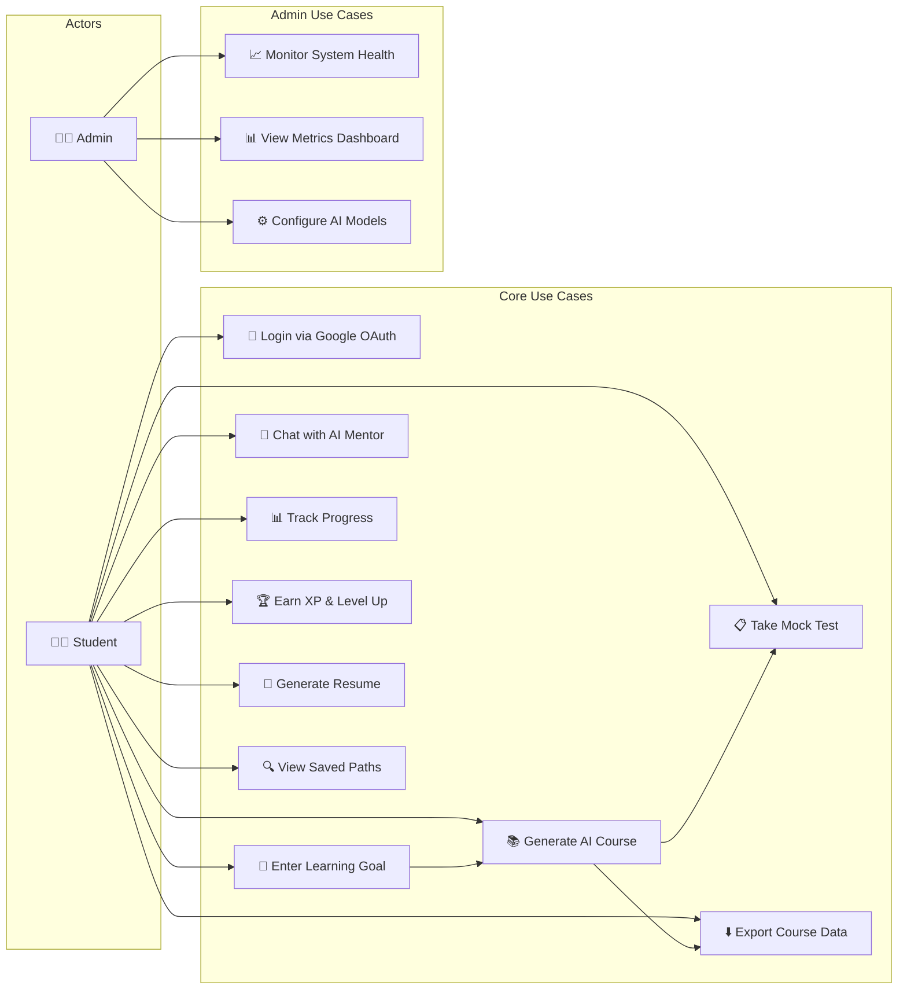
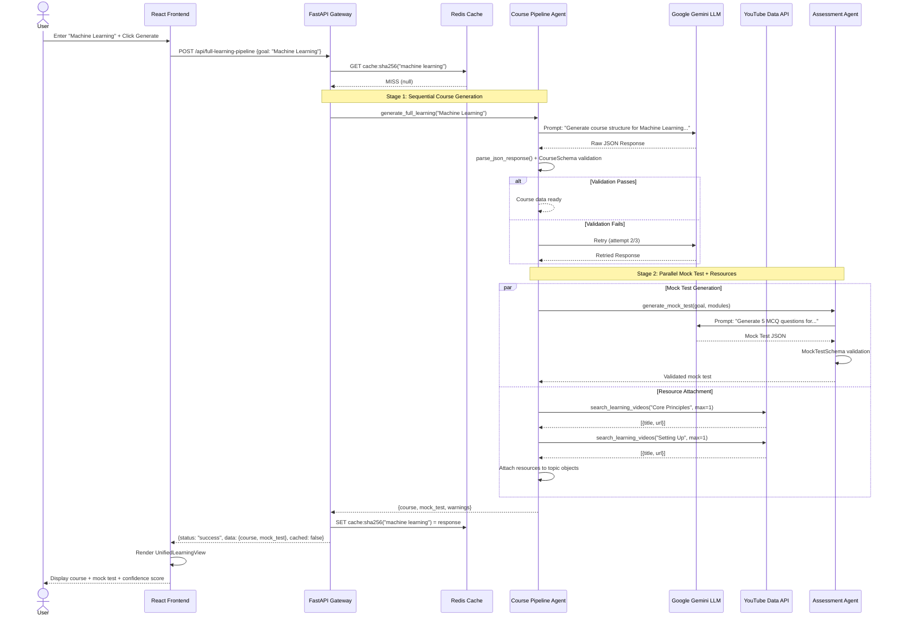
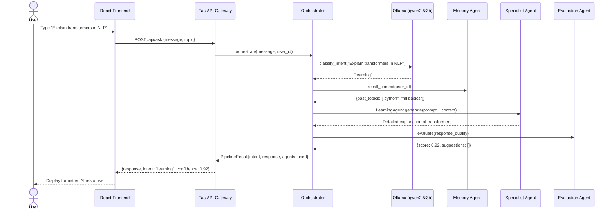
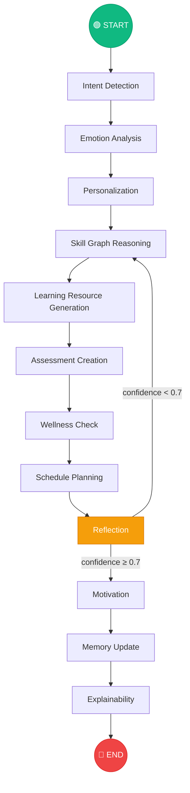
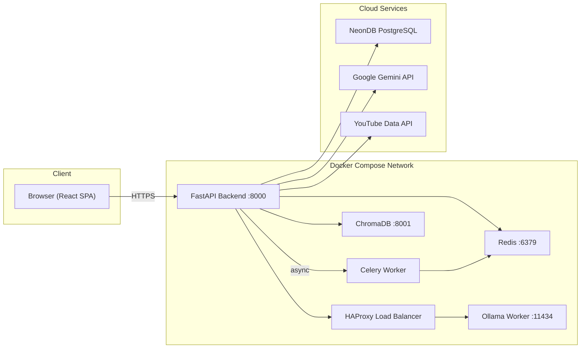

# Chapter 3: Architecture and Diagrams

---

## 3.1 System Architecture Overview

ZenLearn employs a **three-tier architecture** augmented with an AI orchestration layer, designed for modularity, fault tolerance, and horizontal scalability. Each tier operates independently and communicates through well-defined interfaces (HTTP REST, WebSocket, and internal Python function calls). This separation of concerns ensures that changes to the frontend UI do not require backend modifications, and that AI agents can be added, removed, or replaced without affecting the API gateway layer.

### 3.1.1 Tier Breakdown

| Tier | Responsibility | Technologies |
|---|---|---|
| **Presentation Tier** | User interface rendering, client-side state management, theme management | React 18, TypeScript, Vite, Tailwind CSS, Lucide Icons |
| **Application Tier** | API gateway, request routing, authentication, caching, pipeline orchestration | FastAPI, Uvicorn, Pydantic v2, Redis, JWT, Celery |
| **Intelligence Tier** | AI reasoning, content generation, assessment creation, personalization | LangGraph, Google Gemini 2.0 Flash, Ollama (qwen2.5:3b), ChromaDB |
| **Data Tier** | Persistent storage, user management, memory persistence | PostgreSQL (NeonDB), Redis, localStorage |

---

## 3.2 Architecture Diagram



---

## 3.3 Detailed Layer Descriptions

### 3.3.1 Presentation Layer (Frontend)

The frontend is a **single-page application (SPA)** built with React 18 and TypeScript, bundled by Vite for sub-second hot module replacement during development. The component architecture follows a hierarchical pattern:

**Page Components** (top-level routes):
- `AILearningHub.tsx` (87 KB) — The primary learning interface containing course generation, saved paths, progress tracking, and the gamification dashboard.
- `AIMentorPage.tsx` (23 KB) — Conversational AI mentor with multi-domain expertise and intent routing.
- `MockTestPage.tsx` (15 KB) — Standalone adaptive assessment interface.
- `ProfilePage.tsx` (23 KB) — User profile with skill analytics and settings.
- `ResumeBuilderPage.tsx` (39 KB) — AI-powered resume generation and PDF export.

**Shared Components**:
- `UnifiedLearningView.tsx` (29 KB) — Renders the complete pipeline output (course + mock test) with expandable modules, confidence scores, and engagement triggers.
- `ErrorBoundary.tsx` — React error boundary preventing full-application crashes from component-level errors.
- `SkeletonLearningView.tsx` — Animated placeholder UI displayed during pipeline generation.
- `Layout.tsx` + `Sidebar.tsx` — Application shell with navigation and responsive sidebar.

**State Management**: The application uses React Context API (`AIAgentContext.tsx`) for global state, with selective `localStorage` persistence for:
- AI Mentor chat history
- Enhanced learning paths
- Active assessment state
- XP and level progression

### 3.3.2 Application Layer (Backend)

The backend is a **FastAPI** application served by **Uvicorn** (ASGI server) with the following middleware stack:

1. **CORS Middleware** — Enforces allowlist-based cross-origin request policies.
2. **Rate Limiting Middleware** — Prevents abuse by throttling requests per IP address.
3. **Monitoring Middleware** — Logs request latency, status codes, and error rates.

**Key API Endpoints**:

| Method | Endpoint | Description |
|---|---|---|
| POST | `/api/full-learning-pipeline` | Triggers the full course + mock test + resource generation pipeline |
| POST | `/api/ask` | Sends a message to the AI mentor orchestrator |
| POST | `/api/ai-agents/generate-learning-path` | Generates a basic learning path |
| POST | `/api/ai-agents/generate-assessment` | Generates an adaptive assessment |
| GET | `/api/ai-agents/recommendations` | Retrieves personalized recommendations |
| POST | `/api/auth/google` | Handles Google OAuth authentication |
| GET | `/health` | Returns system health status |
| GET | `/metrics` | Returns operational metrics |

### 3.3.3 Intelligence Layer (AI Engine)

This is the core differentiator of ZenLearn. The intelligence layer comprises 11 autonomous agents organized into a LangGraph `StateGraph`:

| Agent | File | Responsibility |
|---|---|---|
| Orchestrator | `orchestrator.py` (15.5 KB) | Intent classification, pipeline routing, agent coordination |
| Course Pipeline | `course_pipeline.py` (11.4 KB) | Full curriculum generation with validation and retry |
| Assessment | `assessment.py` (5.4 KB) | MCQ quiz generation and answer evaluation |
| Learning Resource | `learning_resource.py` (10.5 KB) | YouTube video discovery and article curation |
| Personalization | `personalization.py` (2.4 KB) | Learner profile adaptation (style, difficulty, pace) |
| Skill Graph | `skill_graph.py` (5.3 KB) | Dependency analysis, gap identification, path sequencing |
| Wellness | `wellness.py` (5.0 KB) | Fatigue/stress monitoring, burnout prevention |
| Scheduler | `scheduler.py` (5.2 KB) | Optimal study time and session planning |
| Reflection | `reflection.py` (3.4 KB) | Plan quality evaluation with conditional replanning |
| Motivation | `motivation.py` (5.4 KB) | Milestone celebration, encouragement generation |
| Explainability | `explainability.py` (2.1 KB) | Reasoning chain generation for transparency |
| Memory | `memory_agent.py` (1.3 KB) | Long-term interaction storage and retrieval |

### 3.3.4 Data Layer

**PostgreSQL (NeonDB):** Stores user accounts, authentication tokens, and long-term memory. Accessed via SQLAlchemy async engine with automatic table creation on startup.

**Redis:** Dual-purpose deployment:
- **Caching:** Pipeline responses cached with SHA-256 hash keys (TTL configurable).
- **Task Broker:** Celery task queue for background job processing.

**ChromaDB:** Vector database for semantic search over interaction history and resource embeddings. Deployed as a Docker container with persistent volume storage.

---

## 3.4 Use Case Diagram



---

## 3.5 Sequence Diagram: Full Learning Pipeline



---

## 3.6 Sequence Diagram: AI Mentor Chat



---

## 3.7 LangGraph Workflow Diagram



---

## 3.8 Component Interaction Explanation

### 3.8.1 Agent Communication Protocol

All agents in ZenLearn communicate through a **shared state dictionary** (`AgentState`), implemented as a Python `TypedDict` with 40+ typed fields. This pattern follows the **blackboard architecture** in multi-agent systems, where agents read from and write to a shared knowledge store.

Each agent function accepts an `AgentState` dictionary and returns a partial dictionary containing only the fields it modifies. LangGraph handles state merging automatically, ensuring that an agent's output does not inadvertently overwrite fields set by preceding agents.

**Example: Wellness Agent Interaction**

```
Input State (from Schedule Planning):
  - study_plan: {sessions: [...], total_hours: 8}
  - emotional_state: "stressed"
  - fatigue_level: 0.7

Wellness Agent Processing:
  1. Detects high fatigue (0.7 > threshold 0.5)
  2. Identifies "stressed" emotional state
  3. Generates wellness recommendations

Output State (merged back):
  - wellness_recommendations: [{type: "break", message: "Take 15 min rest"}]
  - burnout_risk: "high"
  - optimal_session_length: "25 min (Pomodoro)"
```

### 3.8.2 Error Propagation

Errors in individual agents do not terminate the pipeline. Each agent is wrapped in a try-catch block that:
1. Logs the error with full context (agent name, input state key values, exception trace).
2. Appends an error record to `state["errors"]`.
3. Passes the state forward to the next agent without the failed agent's modifications.

This design ensures that a failure in the Wellness Agent (e.g., LLM timeout during stress analysis) does not prevent the Motivation Agent from generating encouragement messages based on the data already available in the state.

---

## 3.9 Deployment Architecture



---

## 3.10 Section Summary

This chapter presented the complete architectural blueprint of ZenLearn through:
- **System Architecture Diagram** illustrating the four-tier design with 11 AI agents.
- **Use Case Diagram** mapping student and admin interactions.
- **Sequence Diagrams** tracing the full learning pipeline and mentor chat flows.
- **LangGraph Workflow Diagram** showing the 11-agent directed graph with conditional replanning.
- **Deployment Architecture** depicting the Docker Compose service topology.
- **Component interaction analysis** explaining the blackboard-pattern state sharing protocol and error propagation strategy.
